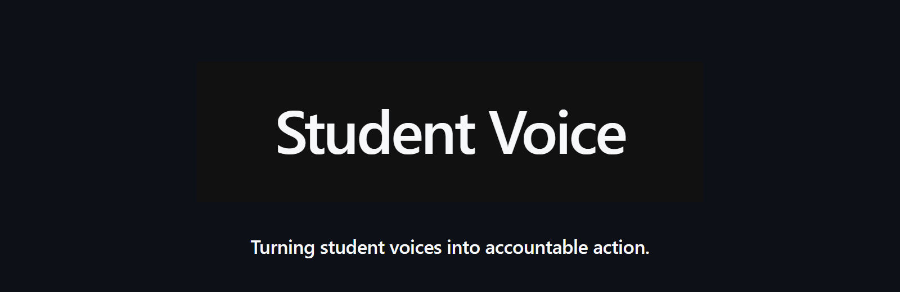
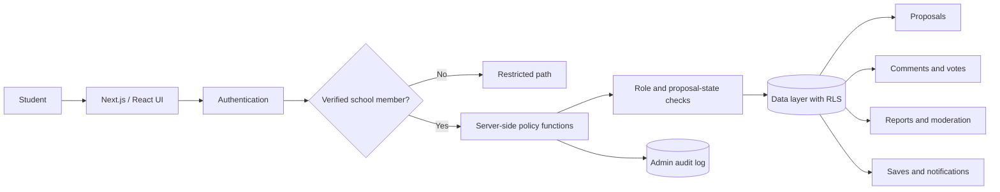

<p align="center">
  <a href="#introduction">
    
  </a>
</p>
<p align="center">
  <br />
  <a href="#introduction"><strong>Introduction</strong></a> ·
  <a href="#architecture"><strong>Architecture</strong></a> ·
  <a href="#security-model"><strong>Security Model</strong></a> ·
  <a href="#validation"><strong>Validation</strong></a>
</p>

<p align="center">
  
  
  
  
</p>

## Introduction

Student Voice is a lightweight web application that enables students to submit feedback and proposals either anonymously or publicly, participate in active discussions, and follow each proposal through its operational status. It was developed and maintained as a real school service rather than a one-time prototype.

As usage grew, the central challenge shifted from implementing visible features to answering a harder question: **who can read, change, moderate, or identify each piece of data?** The service was hardened by moving final authorization decisions away from the interface and into server functions and the data layer.

## Key Features

| Feature | Description |
| --- | --- |
| Anonymous or public proposals | Students can choose how their identity is presented when submitting feedback. |
| Participation | Verified members can vote, comment, save, and report according to proposal state. |
| Status tracking | Students can follow proposal progress and official responses instead of losing feedback after submission. |
| Moderation workflow | Review state and proposal state determine which actions remain available. |
| Conditional identity disclosure | Author identifiers stay hidden in general responses and are exposed only to the author or authorized administrators when required. |
| Auditable administration | Sensitive administrative actions are recorded for later review. |

## Architecture

The public implementation uses Next.js and React with a Node.js runtime, Tailwind CSS, Radix UI, and Vercel deployment. Authorization is evaluated again at the server and database layers even when the interface has already hidden or disabled an action.



### Responsibility Boundaries

| Layer | Responsibility |
| --- | --- |
| Interface | Presents available actions and collects validated input. |
| Authentication | Verifies the school email domain and confirmed email state. |
| Server functions | Resolves membership, administrative roles, and proposal interaction rules. |
| Database policies | Enforces object-level access through row-level security. |
| Audit records | Preserves evidence of sensitive administrative actions. |

## Security Model

Student Voice treats the server and data layer—not the visibility of a button—as the trust boundary.

### Membership and Roles

Registration checks the school email domain (`@dshs.kr`) and email verification status. Server-side functions such as `current_user_is_admin()`, `current_user_is_verified_school_member()`, and `proposal_allows_interaction()` independently decide whether the current request is allowed.

### Object-Level Authorization

Row-level security is applied to core objects including `proposals`, `votes`, `comments`, `reports`, `saves`, and `notifications`. Access is evaluated using the current user, object ownership, proposal state, and moderation state.

### Anonymous Data

Anonymous participation does not mean unrestricted internal access. General queries omit identifying author data, while narrowly defined author-verification and administrative paths can access only the identity information required for their task.

### Function and Input Hardening

Sensitive functions restrict their `search_path`, revoke unnecessary `PUBLIC` and anonymous execution privileges, and grant access only to the required authenticated roles. Category values, title and body lengths, and valid state transitions are checked again through database functions and constraints.

## Operational Hardening

Security changes followed an operational cycle rather than ending with a code patch.

```text
Reproduce the issue
  → apply the smallest safe change
  → recheck authorization and data state
  → verify normal user flows
  → confirm audit records
  → run regression checks
```

This process separated authentication, role resolution, data access, input and state validation, and auditability into independent defensive layers. A mistake in one layer should not automatically become a full authorization bypass.

## Validation

| Validation axis | Expected result |
| --- | --- |
| Unverified or non-school account | Membership-only paths remain unavailable. |
| Another student's object | Unauthorized modification is rejected by the server and data layer. |
| Anonymous proposal or comment | General responses do not expose the author identifier. |
| Proposal in a restricted state | Voting, commenting, reporting, or saving follows the state policy. |
| Sensitive function invocation | Unauthorized roles cannot execute the function. |
| Administrative action | The operation is written to the audit log. |
| Existing user flow after a patch | Valid submissions and interactions continue to work. |

The portfolio records a second official release and a `v1.4-stable` milestone, reflecting continued operation and hardening beyond the initial deployment.

## Technical Scope

- Frontend: Next.js, React, Tailwind CSS, and Radix UI.
- Runtime and deployment: Node.js and Vercel.
- Security: verified school membership, server-side role functions, row-level security, constrained sensitive functions, and audit logs.
- This README documents the architecture and operational security work described in the project portfolio. Reproducible setup instructions can be added when the public repository configuration and deployment secrets are available.

---

<p align="center">
  <strong>Student Voice</strong><br />
  <sub>Turning student voices into accountable action.</sub>
</p>
